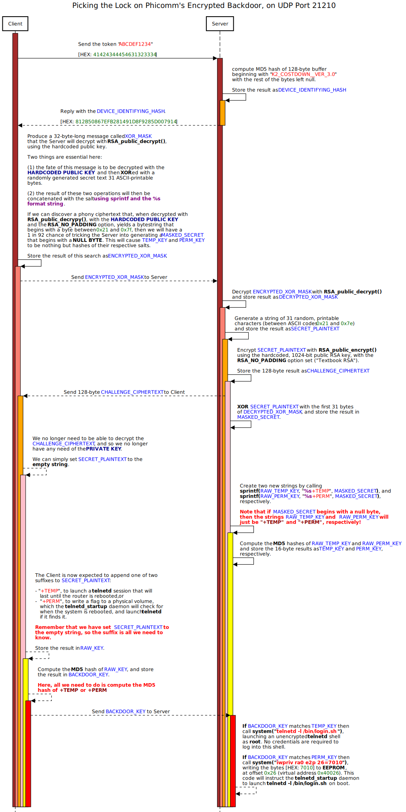

# README

## Expected behaviour of the encrypted backdoor

## How our lockpicking attack works

<!-- Phicomm's Encrypted Backdoor on UDP Port 21210.png Picking the Lock on Phicomm's Encrypted Backdoor on UDP Port 21210.png -->
